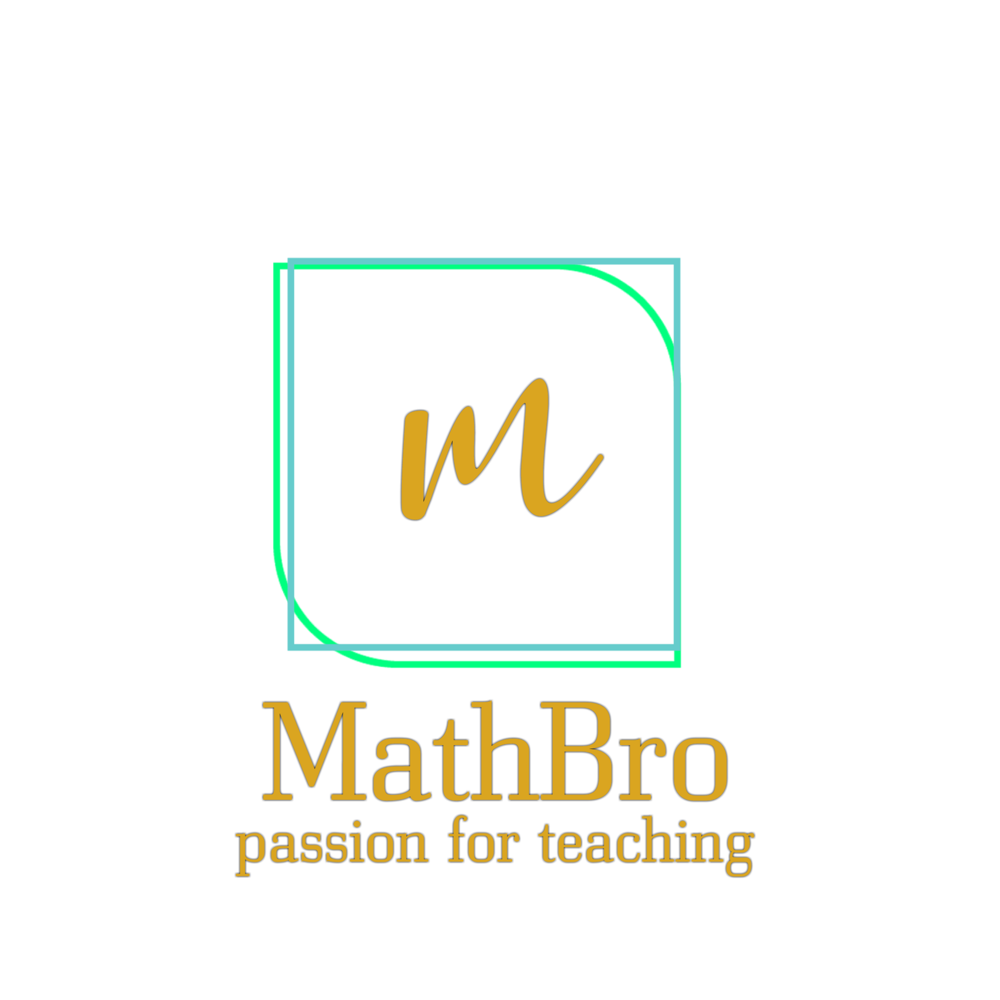

# MathBro

MathBro is a dialogflow app designed to help kids with maths. The goal is to teach maths to kids with new technologies and make it easier for them with the integration with assistants and social apps. The heart of this project is open source, feel free to make any kind of contribution (code, dialogflow, documentation). Let's build a better future.

